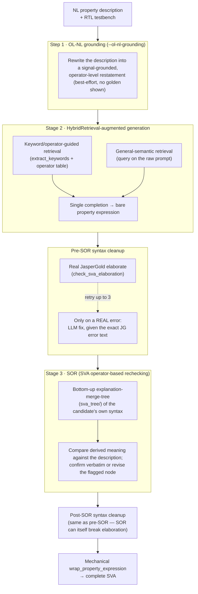

# Hybrid-NL2SVA

Research code for automatically generating SystemVerilog Assertions (SVAs) from natural-language
property descriptions and RTL designs (the *NL2SVA* task), combining a customized retrieval-augmented
generation (RAG) pipeline with LLM fine-tuning on reasoning-annotated datasets.

Manually writing SVAs requires translating a natural-language requirement into formally correct,
signal-grounded assertion syntax — a task where general-purpose LLMs are unreliable without either
relevant retrieved context (operator semantics, similar assertions, design-specific signal
information) or targeted fine-tuning on how an SVA's structure is actually derived from its
description. This repo explores both directions and evaluates them against several NL2SVA benchmarks.

## Repository structure

- **`Src/`** — RAG-based assertion generation pipelines (static and dynamic retrieval, prompted and
  unprompted, multi-round prompting, query expansion), across OpenAI, CodeLlama, DeepSeek, and other
  model backends. `Src/Config.yml` holds API keys and run configuration (kept blank in git — fill in
  your own keys locally).
- **`verilogFinetune/`** — dataset generation and fine-tuning pipeline for teaching a model to *reason*
  its way to an SVA rather than free-associate one: derives an operator-level natural-language (OL NL)
  restatement of a spec, decomposes it top-down per-operator, and re-derives the assertion bottom-up as
  a symbolic proof, validated by formal equivalence checking (JasperGold) against the golden SVA.
  See `verilogFinetune/framework_context/OL_NL_DFS_FRAMEWORK.md` for the full pipeline writeup.
- **`Evaluation/`** — benchmark datasets and evaluation harnesses, including `FVRuleLearner/` (a vendored
  copy of the FVEval benchmark/scoring harness — nested git repo, not tracked here; see
  `Evaluation/FVRuleLearner`'s own README), `FVEval-Verified/` (human-expert-corrected `nl2sva_human`/
  `nl2sva_machine`, used by the pipeline below), and hand-curated assertion/evaluation datasets.
- **`Results/`** — generated result CSVs from running the various pipelines against the evaluation
  datasets.
- **`PlotFigures/`** — scripts and output figures summarizing experiment results.
- **`RAG_Database/`, `SVTextbooks/`, `VerilogTextBooks/`** — source corpora used for retrieval (SVA/
  Verilog textbooks and reference material).
- **`RelatedWorks/`** — reference papers for related NL2SVA/assertion-mining approaches.
- **`TCAD-Hybrid-NL2SVA/`** — LaTeX source for the paper this repo accompanies (nested git repo, not
  tracked here).
- **`operators.json`, `sva_property_sequence_operators.jsonl`** — SVA operator reference tables used
  throughout the generation/explanation prompts.

## Setup

```
pip install -r requirement.txt
```

Fill in your own API keys in `Src/Config.yml` (`Openai_API_Key`, `DeepSeek_API_Key`, etc. — left blank
in version control).

## Where to start

- For the RAG-based generation pipelines: see the scripts under `Src/` (e.g.
  `Src/RAG-Openai-4o-mini-Prompted-Assertion-Generation-1assert1iteration.py`).
- For the fine-tuning dataset pipeline: see `verilogFinetune/framework_context/OL_NL_DFS_FRAMEWORK.md`
  and `verilogFinetune/generate_codev_sva_reasoning_dataset.py`.
- For benchmark evaluation: see `Evaluation/FVRuleLearner/FVEval/`.

## The dynamic RAG + OL-NL + SOR pipeline

`Src/MultiRoundPromptwithOperatorsExplanation/run_rag_on_fveval_benchmarks.py` is the main, most
actively developed generation pipeline. It runs each benchmark row through up to three stages, none
of which ever lets the model write the `assert property (@(posedge clk) disable iff (...) ...)`
wrapper itself — only the bare boolean/temporal-logic expression, mechanically wrapped afterward from
a fixed template:



**Key opt-in flags** (all default off; see `--help` for the full, more detailed list):

| Flag | What it does |
|---|---|
| `--ol-nl-grounding` | Turns on Step 1. Needed for datasets whose questions aren't already signal/operator-grounded (e.g. `nl2sva_human_verified`); redundant for datasets that already name every signal (e.g. `nl2sva_machine_verified`). |
| `--ol-nl-conservative` | Step 1 stays maximally literal — no inventing structure/timing the description doesn't state. |
| `--skip-signal-list-note` | Skips the "use only these signals" note + per-signal descriptions (and the LLM call that builds it). For datasets whose questions already name every signal. |
| `--sor-template-timing` | SOR's explanation-merge-tree uses fixed, deterministic, LLM-free templates (from `sva_temporal_operators.json`'s `template_unary`/`template_binary` fields, covering all 46 documented operators) instead of asking an LLM to compose each node's meaning. |
| `--sor-conservative` | SOR's revision step is told to change only the minimal part responsible for a confirmed mismatch. |
| `--only-overlap-implication` | Generation and SOR are told to always use `\|->` and never `\|=>`, spelling any delay out explicitly as `##N`/`##[M:N]` — sidesteps a confirmed `\|=>`+`##N` double-counting bug at its root. |
| `--workers N` | Thread-pool concurrency for generation (default 6). |
| `--no-rag` | Bypasses everything above — a single-shot 0-shot baseline for comparison. |

Supported `--task` values: the original FVEval `nl2sva_human` / `nl2sva_machine` /
`module_sva_nl_manual_editing`, plus `nl2sva_human_verified` / `nl2sva_machine_verified` (human-expert-
corrected versions of the first two, from `Evaluation/FVEval-Verified/` — see below).

Scoring is done separately, via `verilogFinetune/score_nl2sva_human.py`, against real JasperGold
formal equivalence checking (`syntax` from an independent elaboration check, `functionality`/
`func_relaxed` from `prop_eq_checker`).

## Evaluation results — FVEval-Verified

[`Evaluation/FVEval-Verified/`](Evaluation/FVEval-Verified/) is a human-expert-corrected version of
FVEval's `nl2sva_human` and `nl2sva_machine` benchmarks (from
[wyt2000/FVEval-Verified](https://huggingface.co/wyt2000)), fixing or removing erroneous test cases in
the original FVEval release. Metrics: **SC** = Syntax Correctness (does the candidate elaborate against
the real testbench on its own), **FM-strict** = Functionality Match (formally proven full equivalence
to the golden SVA), **FM-relaxed** = FM-strict plus one-directional `implies` matches.

### `nl2sva_human_verified` (73 rows)

Best configuration found so far: `--ol-nl-grounding --sor-conservative --only-overlap-implication`
(Step 1 is needed here — the prompts aren't already operator-grounded; `--sor-template-timing` was
tested and found to not help on this dataset, unlike on `nl2sva_machine_verified` below).

| Configuration | SC | FM-strict | FM-relaxed |
|---|---|---|---|
| 0-shot baseline (`--no-rag`) | — | 63.0% | — |
| Full pipeline, no SOR-timing fixes | 100.0% | 71.2–74.0% | 83.6–87.7% |
| **+ `--sor-conservative --only-overlap-implication`** | **98.6%** | **74.0%** | **87.7%** |

### `nl2sva_machine_verified` (283 rows)

Best configuration found so far: `--skip-signal-list-note --sor-template-timing --sor-conservative
--only-overlap-implication` (no `--ol-nl-grounding` — the questions already name every signal
directly, so Step 1 is redundant here).

| Configuration | SC | FM-strict | FM-relaxed |
|---|---|---|---|
| Full pipeline, no SOR-timing fixes | 99.3% | 82.0% (232/283) | 90.5% (256/283) |
| **+ full SOR-timing fix combo (above)** | **99.3%** | **85.2% (241/283)** | **95.4% (270/283)** |

The SOR-timing fixes target a confirmed, systematic bug class: the model composing `\|=>` (which
itself advances one clock cycle) together with an explicit `##N` delay, silently landing on `N+1`
total cycles instead of the intended `N` — traced end-to-end (generation → syntax cleanup → SOR
recheck → scoring) across many individual rows before arriving at the fixes above. `sva_graph.py` also
had a real, unrelated parsing bug fixed along the way: range/unbounded delays (`##[M:N]`, `##[*]`,
`##[+]`) were mislabeled `"##None"` internally, discarding their real bounds.

These are single-trial numbers on both datasets; per-row LLM sampling variance is non-trivial (± a few
percentage points between otherwise-identical reruns is common), so treat exact figures as indicative
rather than final, and prefer rerunning before drawing strong conclusions from small deltas.
